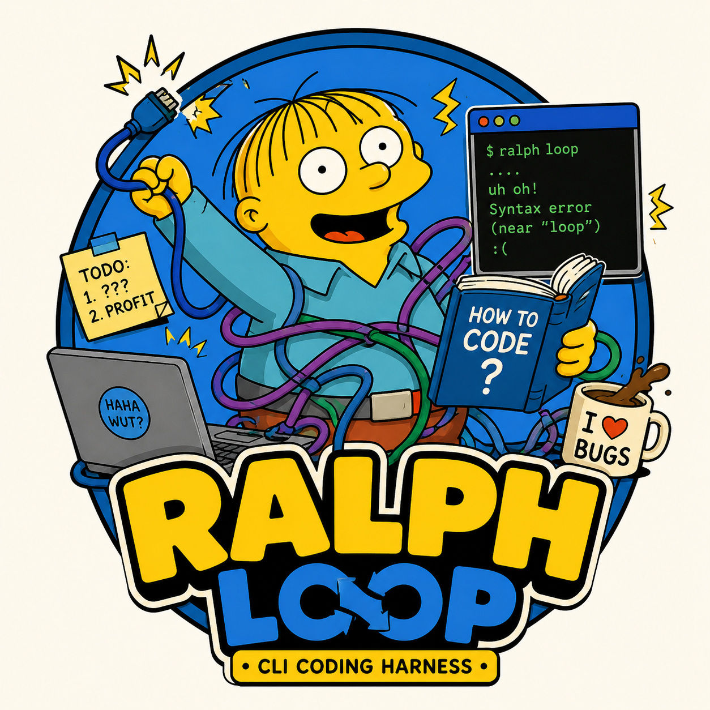

<p align="center">
  
</p>

# ralph

**Hand your AI coding agent a spec, walk away, come back to finished, reviewed commits.**

Ralph runs [Claude Code](https://claude.ai/code), [Codex](https://openai.com/index/codex/), [Copilot CLI](https://github.com/features/copilot) or [pi](https://www.npmjs.com/package/@earendil-works/pi-coding-agent) in a loop, inside a sandbox. Each pass does one small job and leaves notes for the next. A plan becomes commits, and the commits get checked against the spec.

```bash
ralph plan -g specs/checkout-flow.md   # turn a spec into a task list
ralph build                            # work through it, one commit at a time
ralph review                           # check the result against the spec
```

## Quick start

```bash
git clone git@github.com:marc0der/ralph.git && cd ralph && ./install.sh

cd your-project
ralph sandbox                          # step into an isolated container
ralph init                             # create the plan and progress files
ralph plan -g specs/my-feature.md
ralph build
```

Or let it run the whole thing for you: `ralph auto -g specs/my-feature.md`.

You'll need Docker (rootful) and the devcontainer CLI (`npm install -g @devcontainers/cli`) for the sandbox, plus the CLI of whichever agent you use.

## How it works

```
  spec ──▶  plan  ──▶  build  ──▶  review  ──▶  build
             │           │           │            │
          writes     ticks off      adds        fixes
             │           │        findings        │
             ▼           ▼           ▼            ▼
      ═════════════ IMPLEMENTATION_PLAN.md ═════════════
```

An agent forgets everything between sessions, so ralph keeps its memory in two files:

- **`IMPLEMENTATION_PLAN.md`** is the to-do list. `plan` writes it, `build` ticks items off, and `review` adds whatever it finds.
- **`PROGRESS.md`** is the diary. Every pass writes down what it did, what it learned and what broke.

Each command stops by itself when there's nothing left to do. `build` stops when two passes in a row commit nothing, `plan` stops when a pass leaves the plan unchanged, and `review` runs exactly one pass.

The three phases have different jobs:

- **`plan`** reads your spec and the code, and writes small, self-contained tasks. It needs a goal: a spec file, a directory, or a sentence.
- **`build`** picks the next open task, implements it, runs the tests, commits and pushes. It sizes itself to the plan: one pass per open task, plus 20% headroom.
- **`review`** checks the cycle's work in one pass against the specs the plan cited, your project's written rules and a fixed catalogue of code-quality defects. It adds every finding as a new task, and only runs once every task has shipped.

A capable model writing the plan and a cheaper one following it works well:

```bash
ralph plan -g specs/checkout-flow.md   # default model writes the plan
ralph build -m sonnet                  # a cheaper model follows the steps
```

*The name comes from the [Ralph Wiggum pattern](https://github.com/ghuntley/how-to-ralph-wiggum) and Ralph's cheerful "I'm helping!", which is an agent working through a list without needing its hand held.*

## Running unattended

`ralph auto` runs the whole cycle in one go: `archive`, `init`, `plan`, `build`, `review`, and a final `build` to fix what review found.

```bash
ralph auto -g specs/checkout-flow.md
```

- **It skips what has nothing to do.** A build with no open tasks, or a review with unfinished work, is skipped rather than failed.
- **It only runs in a container.** Outside one it refuses to start. Pass `--force` if your runner is already isolated.
- **It tells you what happened.** At the end you get a `Lifecycle summary`, one row per phase: ran, skipped and why, failed, or not reached.
- **It can pick up where it stopped.** After a failure or `Ctrl-C`, fix the problem and run `ralph auto --resume -g specs/checkout-flow.md`. It never re-runs `archive` or `init`.

`--dry-run` shows the six commands it would run, without running any. Every phase gets your `-m`, `-b`, `--skip-push`, `--no-metrics` and `-v` flags. Only `-n` is refused, because each phase sizes itself.

## Day to day

### Starting a new goal

Finish the old cycle with `ralph review` first, because the plan is the only record of which specs it covered. Then clear the way:

```bash
ralph archive                  # keep the old plan and progress under .ralph/
ralph plan -g "New goal"
```

Use `ralph clean` instead of `archive` if you don't need the history.

### Choosing an agent and model

```bash
ralph build -b codex           # use Codex
ralph build -b copilot -n 10   # use Copilot, at most 10 passes
ralph build -m sonnet          # use a different model
```

| Backend   | Default model               |
|-----------|-----------------------------|
| `claude`  | `opus`                      |
| `codex`   | `gpt-5.2-codex`             |
| `copilot` | `claude-sonnet-4.6`         |
| `pi`      | `anthropic/claude-opus-4-8` |

### Watching a run

A normal run prints one line per pass. Add `-v` to watch the agent work as it happens: one line per tool call and per message. (For Codex and Copilot, `-v` prints the raw output after each pass.)

Every run also keeps a record under `.ralph/metrics/`: how long each pass took, what it cost, and what it committed. Run `ralph metrics` to see the latest run as a table. Cost and token counts are recorded for the `claude` backend only.

### When something goes wrong

Just run the command again. All a pass needs is the plan and the progress log, so the next `build` carries on from wherever the last one stopped. If a push is rejected, pull and resolve the conflict yourself, then re-run.

## Sandbox and safety

Agents run headless, so they can't stop and ask before running a command. Ralph turns on each agent's "don't ask" mode (`--dangerously-skip-permissions`, `--yolo` and friends; pi needs none). That's only safe somewhere the agent can't do damage, which is what the sandbox is for.

```bash
ralph sandbox              # start or reuse this project's container
ralph sandbox --rebuild    # rebuild the image, e.g. after updating ralph
ralph sandbox clean        # remove the container
```

Each project gets its own container, with every supported agent, Node.js, Bun, uv, SDKMAN and the Docker CLI pre-installed. Your agent logins, git and GitHub config, SSH agent and API keys come with you. [docs/sandbox.md](docs/sandbox.md) lists exactly what is mounted and forwarded.

Outside a container, ralph warns you and asks `Continue anyway? [y/N]` before it starts. Pass `-y` to skip the question. Scripts and CI, which have no terminal, go ahead without it.

## Customising

**Your project's rules.** Ralph reads your `CLAUDE.md` or `AGENTS.md` on every pass, but never writes to it. Put your build and test commands, conventions and gotchas there. If it points to a directory of written rules, every phase follows those rules and review reports code that breaks them.

**The prompts.** `ralph init --prompts` copies the prompts into your project as `PROMPT_plan.md`, `PROMPT_build.md` and `PROMPT_review.md`, where they override the installed ones. The defaults mention Claude model names, so edit them if you use another agent. A local copy doesn't update when ralph does, so refresh it after an upgrade.

**Commit style.** The build prompt asks for small [Conventional Commits](https://www.conventionalcommits.org/), with only the relevant files staged. The plan, progress log and `.ralph/` are never committed. Edit `PROMPT_build.md` to change this.

**Further reading:**
- [docs/plan-format.md](docs/plan-format.md): what a plan item looks like and the rules it follows
- [docs/meta-repositories.md](docs/meta-repositories.md): using ralph in a workspace that clones several services

## Reference

### Commands

| Command             | What it does |
|---------------------|--------------|
| `plan`              | Turn a goal into `IMPLEMENTATION_PLAN.md`. Requires `-g`. At most 6 passes |
| `build`             | Implement, test, commit and push the next open item (default: open items plus 20% headroom) |
| `review`            | Review the cycle's work against its specs, rules and catalogue, and add findings as new items. One pass |
| `auto`              | Run the whole lifecycle unattended: archive, init, plan, build, review, build. Requires `-g`; refuses to run outside a container |
| `sandbox`           | Enter this project's devcontainer. `--rebuild` rebuilds the image |
| `sandbox clean`     | Remove this project's devcontainer |
| `init`              | Create `IMPLEMENTATION_PLAN.md`, `PROGRESS.md` and `specs/`. `--prompts` also copies the prompts |
| `archive`           | Move the plan and progress log to `.ralph/<timestamp>/` |
| `clean`             | Delete the plan and progress log |
| `metrics`           | Summarise the latest run's metrics, or a given `metrics.jsonl` |
| `version`           | Print the version |

### Options (plan, build, review and auto)

| Flag                 | Description |
|----------------------|-------------|
| `-g`, `--goal`       | The spec, directory or sentence to plan from. `plan` and `auto` only, and required there |
| `-n`, `--iterations` | Maximum passes. In `build` it also stops the early exit. `review` and `auto` refuse it |
| `-m`, `--model`      | Model to use (default depends on the backend) |
| `-b`, `--backend`    | `claude`, `codex`, `copilot` or `pi` (default: `claude`) |
| `--skip-push`        | Don't push after each build pass |
| `--dry-run`          | Show what would run, without running it |
| `--no-metrics`       | Don't record metrics under `.ralph/metrics/` |
| `-v`, `--verbose`    | Stream the agent's activity live |
| `-y`, `--yes`        | Skip the `Continue anyway? [y/N]` prompt outside a sandbox |
| `--resume`           | `auto` only: continue from the phase that failed |
| `--force`            | `auto` only: run outside a container |
| `-h`, `--help`       | Show help |

### Files

| File                     | Purpose |
|--------------------------|---------|
| `IMPLEMENTATION_PLAN.md` | The task list shared between passes |
| `PROGRESS.md`            | Append-only log of what each pass did, learned and broke |
| `specs/`                 | Your specifications: what to build |
| `CLAUDE.md`, `AGENTS.md` | Your project's rules for the agent. You own these |
| `PROMPT_*.md`            | Optional project-local prompts |
| `.ralph/`                | Archives, metrics and `auto` state. Gitignored by `ralph init` |

### Environment

| Variable           | Default           | Description |
|--------------------|-------------------|-------------|
| `RALPH_BIN_DIR`    | `~/.local/bin`    | Where `install.sh` puts the CLI |
| `RALPH_CONFIG_DIR` | `~/.config/ralph` | Where prompts, templates and container config live |

## Troubleshooting

**`ralph: command not found` after installing.** Add `~/.local/bin` to your `PATH`.

**Ralph can't find the agent's CLI.** Install the one you're using: [Claude Code](https://docs.anthropic.com/en/docs/claude-code), `npm install -g @openai/codex`, `npm install -g @github/copilot` or `npm install -g @earendil-works/pi-coding-agent`.

**The sandbox is broken or out of date.** Run `ralph sandbox clean`, then `ralph sandbox`. After updating ralph, use `ralph sandbox --rebuild`.

**`sandbox` fails with `invalid mount config ... operation not supported`.** Your SSH agent socket can't be shared with Docker, which is common with Colima on macOS. Run `SSH_AUTH_SOCK="" ralph sandbox`. [docs/sandbox.md](docs/sandbox.md#ssh-agent-socket-cannot-be-mounted) explains why.

**`build` never stops early.** Your tests probably create git repositories inside the project, which looks like progress on every pass. Create them under `$TMPDIR` instead.

**Problems in a meta repository.** See [docs/meta-repositories.md](docs/meta-repositories.md#troubleshooting).

## Development

```bash
nix-shell                      # provides bats and shellcheck
bats test/
shellcheck ralph install.sh
shellcheck test/*.bats test/test_helper.bash
```
